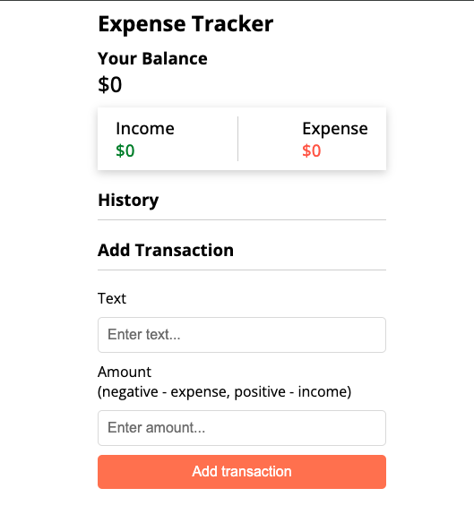

# Expense Tracker

This project is an expense tracker developed with Vue.js

Demo link: https://expense-tracker-beryl-omega.vercel.app



## Project Setup

```sh
npm install
```

### Compile and Hot-Reload for Development

```sh
npm run dev
```

### Compile and Minify for Production

```sh
npm run build
```

# expense-tracker-vue
